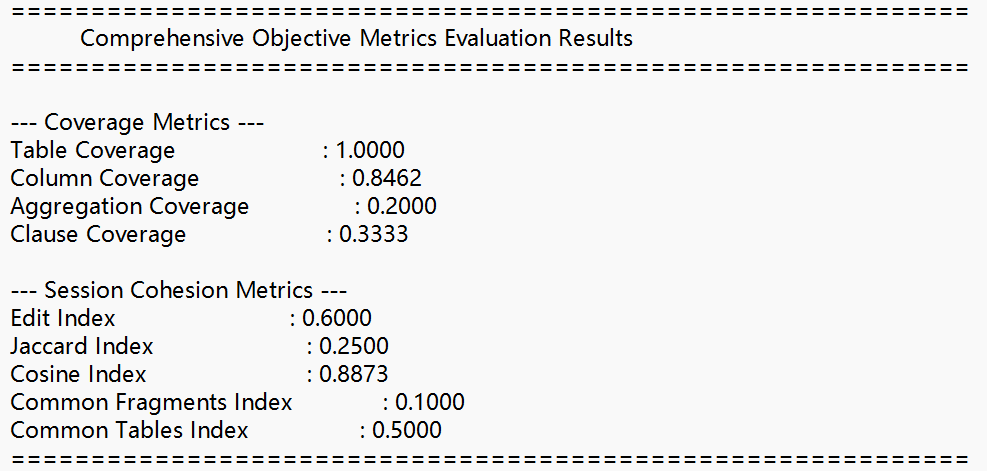

### Related issue: integrate metrics for recommendation evaluation

### What's Changed

This update introduces a suite of objective metrics to evaluate the performance of query recommendations. The evaluation focuses on two key areas: Coverage and Session Cohesion.

#### Modular Components

The new functionality is organized into three main files:

* coverage_metrics.py: Measures recommendation breadth using **Table, Column, Aggregation, and Clause Coverage**.
* cohesion_metrics.py: Evaluates the logical flow of a user's session with **Edit, Jaccard, Cosine, Common Fragments, and Common Tables Indices**.
* main_evaluator.py: The main script that orchestrates the evaluation process, reads session logs, and generates a consolidated report.

### How to Test

#### 1. Setup

* **Install Dependencies**: First, ensure you have the required Python libraries installed.
    ```bash
    pip install numpy sql-metadata
    ```

* **Directory Structure**: The evaluation scripts rely on a specific directory layout. Please ensure your `metrics` folder is structured as follows and that your data files are placed in the correct locations.

    ```
    metrics/
    ├── dataset/
    │   └── spider/
    │       ├── database/
    │       │   └── customers_and_addresses/  <-- Place schema folders here
    │       │       └── schema.sql
    │       │   └── ... (other database schemas)
    │       └── user-json-test/
    │           └── session_log_1.json      <-- Place user session logs here
    │           └── session_log_2.json
    │           └── ...
    ├── results/                              <-- Output reports will be generated here
    ├── cohesion_metrics.py
    ├── coverage_metrics.py
    ├── main_evaluator.py
    └── README.md
    ```

#### 2. Run the Evaluation

* **Navigate to the Directory**: Open your terminal and navigate into the `metrics` folder.
    ```bash
    cd path/to/your/project/metrics
    ```

* **Execute the Script**: Run the main evaluator script. It will automatically find and process all JSON files in the `user-json-test` directory.
    ```bash
    python main_evaluator.py
    ```
    *Note: If you are evaluating sessions against a database other than `customers_and_addresses`, please update the `DEFAULT_SCHEMA_FOLDER` variable inside `main_evaluator.py`.*

#### 3. Verify the Output

*   **Inspect the Report Files**:
    *   Navigate to the `metrics/results/` directory.
    *   You will find a `.txt` report file for each JSON log that was processed.
    *   Open any report to see the calculated **Coverage Metrics** and **Session Cohesion Metrics**.


